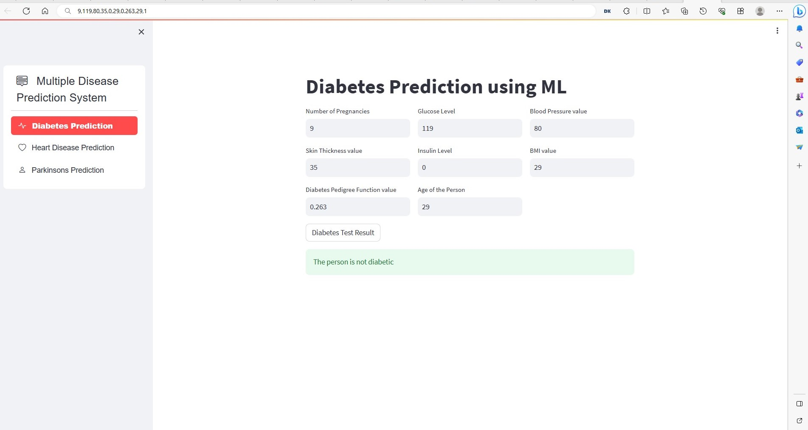

# Multiply-Disease-Detection

## Description

Multiply-Disease-Detection is a Streamlit app that utilizes machine learning models to predict the likelihood of three different diseases: diabetes, heart disease, and Parkinson's disease. The app allows users to input relevant features and receive predictions about the presence of these diseases.

## Features

- User-friendly interface for inputting relevant medical data.
- Integration of machine learning models for disease prediction.
- Interactive visualizations to display prediction results.

## How to Use

1. Clone the repository:

